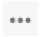
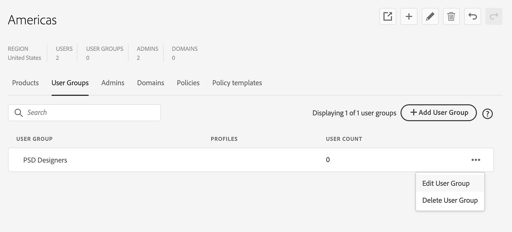

# Hantera användargrupper i Global Admin Console

Skapa, hantera och dela användargrupper i Global Admin Console för att effektivisera användarhanteringen genom att gruppera användare med samma behörigheter, spara tid och säkerställa enhetlighet.

I [Global Admin Console](https://helpx.adobe.com/enterprise/global-admin-console/adopt-global-administration.html) väljer du en organisation och navigerar till **[!UICONTROL User Groups]**. Dela grupper i flera organisationer med hjälp av en enda användarhanteringskälla för att synkronisera användare och grupper.

[Logga in på Global Admin Console](https://global-admin-console.adobe.com)

## Skapa användargrupper

Du kan antingen [skapa användargrupper](https://helpx.adobe.com/se/enterprise/using/user-groups.html) individuellt, gruppvis eller [synkronisera dem direkt från en etablerad Azure AD](https://helpx.adobe.com/enterprise/using/add-azure-sync.html) till en federerad katalog i Adobe Admin Console. I Global Admin Console kan du definiera användargrupper med relevanta produktprofiler tilldelade, som användargruppadministratörer senare kan lägga till användare med Admin Console.

1. Logga in på [Global Admin Console](https://global-admin-console.adobe.com/), markera en organisation som du vill redigera och navigera sedan till fliken **[!UICONTROL User Groups]** .

2. Välj **[!UICONTROL Add User Group]**.

   

   _Lägg till användargrupper i en organisation för att effektivisera användarhanteringen._

3. Ange följande i dialogrutan **[!UICONTROL Add User Group]** som visas:
   - **[!UICONTROL Name]**: Ange ett namn för användargruppen.
   - **[!UICONTROL Product Profiles]**: Om du vill ge produktåtkomst till aktuella eller framtida medlemmar i användargruppen klickar du på listrutepilen för att välja en produktprofil i listan eller anger namnet på produktprofilen och väljer den i listrutan som visas. Om du vill lägga till en produktprofil som inte redan har skapats måste du först göra det på fliken [Produktprofiler](https://helpx.adobe.com/enterprise/using/global-admin-edit-organizations.html#profiles).
   - **[!UICONTROL Admins]**: Klicka på listrutepilen för att välja en administratör i listan eller ange administratörens e-postadress och välj den i listrutan som visas. Om du vill lägga till en ny administratör som inte redan har skapats måste du först skapa den administratören med hjälp av fliken [Administratörer](#share-user-groups).

   De produktprofiler du anger tilldelas användargruppen och de administratörer du anger blir gruppadministratörer för gruppen. Administratörer för användargrupper kan använda Adobe Admin Console för den aktuella organisationen för att hantera gruppen.

4. Välj **[!UICONTROL Save]**.

5. Välj **[!UICONTROL Review pending changes]** om du vill granska uppdateringarna. Välj sedan **[!UICONTROL Submit changes]** för att [köra](https://helpx.adobe.com/enterprise/global-admin-console/set-up-organizations.html#execute-jobs) dem.

   >[!NOTE]
   >
   >Globala administratörer kan [tilldela produktprofiler och användargruppadministratörer](#review-user-groups) till användargrupper med Global Admin Console. Med Adobe Admin Console kan systemadministratörer och användargruppadministratörer [lägga till användare och tilldela administratörer och produktprofiler](https://helpx.adobe.com/se/enterprise/using/user-groups.html) till användargruppen.

## Dela användargrupper

Gruppprojektion gör att du kan synkronisera användargrupper och associerade användare från en enda hanteringskälla till flera administrationskonsoler. Globala administratörer kan dela användargrupper med hierarkiska underordnade i källorganisationen, arbeta nedåt, inte uppåt eller sida vid sida.

1. Logga in på [Global Admin Console](https://global-admin-console.adobe.com/), välj en organisation och gå till fliken **[!UICONTROL User Groups]**.

2. Markera kryssrutorna för de användargrupper som du vill dela.

   Grupper kan inaktiveras för delning i följande fall:
   - Användargruppen delas från en annan organisation. Om du vill dela eller redigera gruppen väljer du den organisation som äger den från organisationshierarkin.
   - Organisationen använder inte [Adobe-lagring för företag](https://helpx.adobe.com/in/enterprise/using/storage-for-business.html), som introduceras globalt i faser.
   - Organisationsprincipen är inaktiverad. Gå till fliken **[!UICONTROL Policies]** för att aktivera principen **[!UICONTROL Manage shared user groups]**.
   - Organisationen har inga underordnade organisationer att dela användargrupper med.

3. Välj **[!UICONTROL Share user group]**.

4. Granska användargrupperna och dela dem med andra organisationer. Om du också är systemadministratör i den valda organisationen väljer du **[!UICONTROL Open in Admin Console]** Ikonen  om du vill granska listan över användargruppsmedlemmar i Adobe Admin Console.

   >[!NOTE]
   >
   >Om du vill förhindra konflikter kontrollerar du att de organisationer som du vill dela användargrupper med inte redan har grupper med samma namn.

5. Välj **[!UICONTROL Next]**.

6. Välj de organisationer som du vill dela användargrupper med och välj **[!UICONTROL Next]**.

7. Om det inte finns några konflikter väljer du **[!UICONTROL Share User Groups]**.

   Om det finns konflikter (där användargrupper med samma namn finns i målorganisationen) väljer du något av följande alternativ och väljer sedan **[!UICONTROL Share User Groups]**:
   - **[!UICONTROL Ignore (default)]**: Hoppa över grupperna i målgrupperna med samma namn.
   - **[!UICONTROL Add only]**: Lägg samman användargrupperna genom att lägga till nya användare i de befintliga användargrupperna utan att ta bort några användare.
   - **[!UICONTROL Mirror group]**: Justera målorganisationens grupper så att de matchar den delade gruppen genom att lägga till eller ta bort användare.

8. Välj **[!UICONTROL Review pending changes]** om du vill granska uppdateringarna. Välj sedan **[!UICONTROL Submit changes]** för att [köra](https://helpx.adobe.com/enterprise/global-admin-console/set-up-organizations.html#execute-jobs) dem.

   Gruppprojektionshändelser loggas som referens. Lär dig [visa och hämta granskningsloggar](https://helpx.adobe.com/enterprise/global-admin-console/insights.html).

När du delar en användargrupp läggs gruppen och dess användare till i målorganisationen. Källanvändargruppen *styr* de delade användargrupperna och deras användare. Admin- och produktprofiltilldelningar är *inte* synkroniserade mellan organisationer.

Ändringar i den projicerade användargruppens namn eller associerade användare i källanvändargruppen uppdateras automatiskt i målorganisationen. Även om den delade användargruppen inte kan hanteras direkt, kan en administratör i målorganisationen tilldela produktprofiler till en delad grupp och ge åtkomst till gruppens användare.

## Återkalla åtkomst till delade grupper

1. Logga in på [Global Admin Console](https://global-admin-console.adobe.com/), välj en organisation och gå till fliken **[!UICONTROL User Groups]**.

2. Välj **[!UICONTROL Manage shared access]** för den relevanta användargruppen.

3. Välj de organisationer som du vill återkalla åtkomst från.

4. Välj **[!UICONTROL Revoke access]**.

5. När du återkallar åtkomst kan du välja att antingen ta bort användargruppen och användarna eller lämna en kopia i målorganisationerna:
   - När användargruppen tas bort tas den bort från målorganisationerna. Användare som inte är medlemmar i andra delade grupper tas bort från målorganisationerna och förlorar åtkomsten till alla produkter, tjänster och resurser.
   - När användaren lämnar en kopia blir användargruppen och användarna kvar i målorganisationen och behåller alla uppgifter intakta. Användargruppen kommer dock inte längre att synkroniseras och kan hanteras av målorganisationernas administratörer.

6. Välj **[!UICONTROL Revoke access]**.

7. Välj **[!UICONTROL Review pending changes]** om du vill granska uppdateringarna. Välj sedan **[!UICONTROL Submit changes]** för att [köra](https://helpx.adobe.com/enterprise/global-admin-console/set-up-organizations.html#execute-jobs) dem.

## Redigera användargrupper

1. Logga in på [Global Admin Console](https://global-admin-console.adobe.com/), välj en organisation och gå till fliken **[!UICONTROL User Groups]**.

2. Välj **[!UICONTROL More Options]** -ikon för den aktuella användargruppen och välj **[!UICONTROL Edit User Group]**.

   >[!NOTE]
   >
   >Du kan inte redigera användargrupper som den valda organisationen inte äger.

   

   _Redigera användargrupperna för att uppdatera användargruppens namn, produktprofiler eller administratörer._

3. Uppdatera användargruppens namn, produktprofiler eller administratörer. Välj sedan **[!UICONTROL Save]**.

   >[!NOTE]
   >
   >I guiden **[!UICONTROL Edit User Group]** kan du bara tilldela administratörsroller till användare som redan har en administratörsroll tilldelad i den här organisationen. Lär dig hur du [lägger till nya administratörer](https://experienceleague.adobe.com/en/docs/support-resources/adobe-support-tools-guide/adobe-admin-console/manage-administrators).

4. Välj **[!UICONTROL Review pending changes]** om du vill granska uppdateringarna. Välj sedan **[!UICONTROL Submit changes]** för att [köra](https://helpx.adobe.com/enterprise/using/global-admin-set-up-organizations.html#execute-jobs) dem.

   >[!NOTE]
   >
   >Om du ändrar namnet på en delad användargrupp uppdateras ändringarna automatiskt i målorganisationen.

## Ta bort användargrupper

1. Logga in på [Global Admin Console](https://global-admin-console.adobe.com/), välj en organisation och gå till fliken **[!UICONTROL User Groups]**.

2. Välj **[!UICONTROL More Options]** -ikon för den aktuella användargruppen och välj **[!UICONTROL Delete User Group]**.

   >[!NOTE]
   >
   >Du kan inte ta bort användargrupper som den valda organisationen inte äger.

3. Välj **[!UICONTROL Ok]** i dialogrutan som visas.

   >[!CAUTION]
   >
   >Om du tar bort en användargrupp kan det påverka dina användare. Kontrollera att det inte finns någon åtkomst eller information som går förlorad när användargruppen tas bort.

4. När du har redigerat organisationerna väljer du **[!UICONTROL Review pending changes]** för att granska dem. Välj sedan **[!UICONTROL Submit changes]** för att [köra](https://helpx.adobe.com/enterprise/using/global-admin-set-up-organizations.html#execute-jobs) dem.
