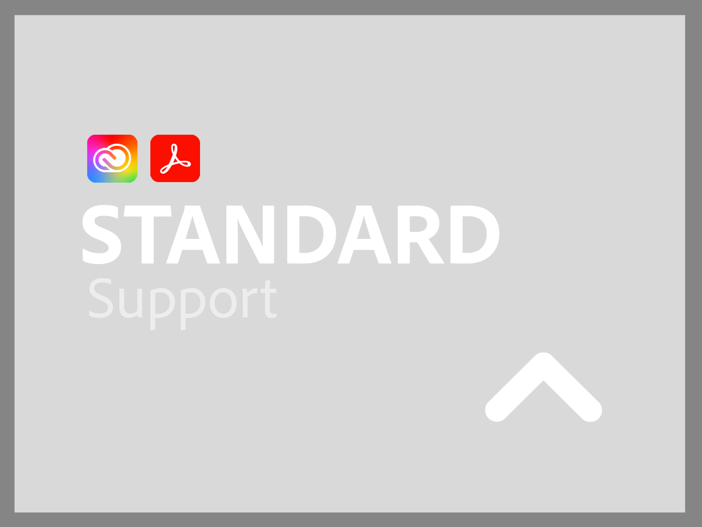
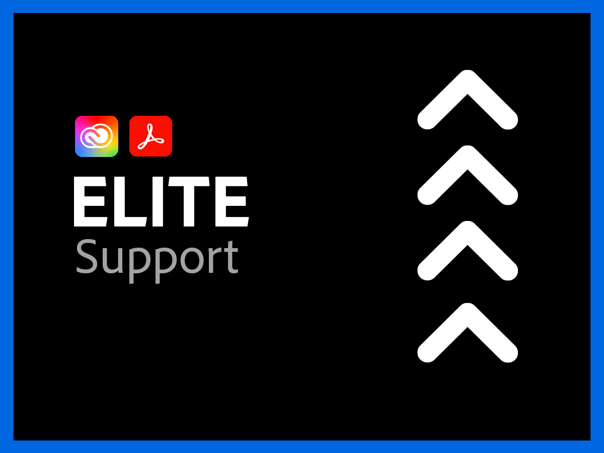

# Supporttjänster för Creative Cloud Enterprise och Document Cloud

Adobe Creative Cloud och Document Cloud kundsupportorganisationen arbetar aktivt för att du ska lyckas. Alla program har en supportnivå som ger enkel tillgång till våra kvalificerade tekniska resurser för teknisk hjälp.

För mer omfattande behov erbjuder vi Adobe Support-planer som inkluderar tillgång till namngivna supportmedarbetare och sessioner för proaktiv mentorskap och servicegranskningar. Oavsett hur komplext ditt supportbehov är, erbjuder Adobe den tekniska och operativa expertis som behövs för att hjälpa dig att uppnå topprestanda och optimalt värde från dina Adobe-program.

<table style="table-layout:fixed">
<tr>
  <td>
    
    

    <a href="dme-standard.md"><strong>Standard-support</strong></a> (visa <a href="assets/DMeStandardSupportDatasheet_2022.pdf" target="_blank">PDF</a>)
    

    
Tillgång dygnet runt för behöriga användare (administratörer) till våra tekniska supportteam via chatt eller telefon samt möjlighet att logga förfrågningar om hjälp via vår webbportal för support. 

     
  </td>
  <td>
    
    

    <a href="dme-business.md"><strong>Business-support</strong></a> (visa <a href="assets/DMeBusinessSupportDatasheet_2022.pdf" target="_blank">PDF</a>)
    

    
Prioriterad dirigering av supportärenden för snabbare anslutning till mer senior support och möjligheten att utnyttja en kontosupportansvarig för att få regelbunden kommunikation och uppdateringar för dina mest kritiska supportärenden.

     
  </td>
</tr>
<tr>
  <td>
    
    

    <a href="dme-enterprise.md"><strong>Enterprise-support</strong></a> (visa <a href="assets/DMeEnterpriseSupportDatasheet_2022.pdf" target="_blank">PDF</a>)
    

    
En utsedd teknisk kontakt i Adobes supportteam med djup erfarenhet av din lösning kommer att arbeta i partnerskap med dig och dina tekniska team för att säkerställa att alla supportförfrågningar löses i tid.

     
  </td>
  <td>
    
    

    <a href="dme-elite.md"><strong>Elite-support</strong></a> (visa <a href="assets/DMeEliteSupportDatasheet_2022.pdf" target="_blank">PDF</a>)
    

    
Dedikerad teknisk kontakt i Adobe-supportteamet och en teknisk kontoansvarig som arbetar tillsammans med dig för att ge förstklassig proaktiv support så att du kan maximera din investering och undvika problem innan de uppstår.

     
  </td>
</tr>
</table>

