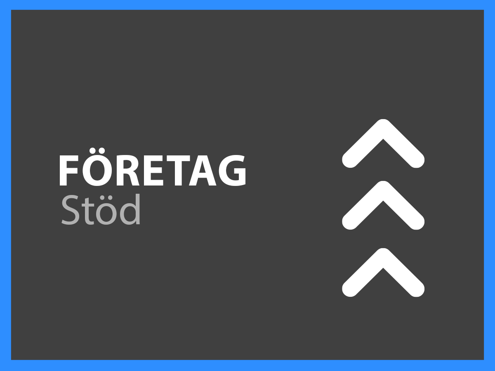

# Experience Cloud Support Services – översikt

Adobe Experience Cloud Customer Support-organisationen är engagerad i din framgång. Alla prenumerationer inkluderar en supportnivå som ger enkel tillgång till våra högkvalificerade tekniska resurser för teknisk assistans.

För mer omfattande behov erbjuder vi Adobe Support-tjänster som inkluderar tillgång till namngivna supportmedarbetare, mål för snabbare respons på servicenivåer och sessioner för proaktivt mentorskap och servicegranskningar. Oavsett hur komplexa dina supportbehov är, erbjuder Adobe den tekniska och operativa expertis som behövs för att hjälpa dig att uppnå topprestanda och optimalt värde från din Adobe-lösning.

<table style="table-layout:fixed">
<tr>
  <td>
    
    

    <a href="online.md"><strong>Onlinesupport</strong></a> (visa <a href="assets/OnlineSupportDatasheet.pdf" target="_blank">PDF</a>)
    

    
Begränsad åtkomst till telefonsupport

     
  </td>
  <td>
    
    

    <a href="business.md"><strong>Business-support</strong></a> (visa <a href="assets/BusinessSupportDatasheet.pdf" target="_blank">PDF</a>)
    

    
Fullständig tillgång till Adobes tekniska supportteam och till en kontosupportansvarig för kontohantering

     
  </td>
</tr>
<tr>
  <td>
    
    

    <a href="enterprise.md"><strong>Enterprise-support</strong></a> (visa <a href="assets/EnterpriseSupportDatasheet.pdf" target="_blank">PDF</a>)
    

    
Förbättrade servicenivåmål för support (SLT), fördelar med teknisk expertis och en representant i form av en namngiven supporttekniker.

     
  </td>
  <td>
    
    

    <a href="elite.md"><strong>Elite-support</strong></a> (visa <a href="assets/EliteSupportDatasheet.pdf" target="_blank">PDF</a>)
    

    
Förstklassiga servicenivåmål (SLT), proaktiv support och partnerskap med en teknisk kontoansvarig och en namngiven supporttekniker

     
  </td>
</tr>
</table>
