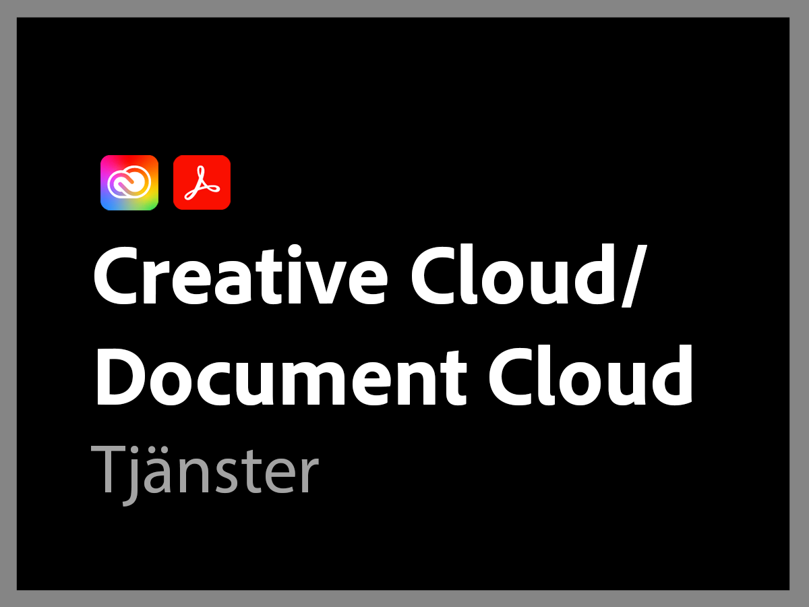

# Översikt över tidigare Adobe Support-planer

>[!NOTE]
>
>Denna plan avser Adobe Support-planer före den 16 juni 2022. Aktuella supportplaner finns på [Översikt över Adobe Support-erbjudanden](overview.md).

Adobes supportorganisation är engagerade i att du lyckas. Alla prenumerationer inkluderar en supportnivå som ger enkel tillgång till våra högkvalificerade tekniska resurser för teknisk assistans.

För mer omfattande behov erbjuder vi Adobe Support-tjänster som inkluderar tillgång till namngivna supportmedarbetare och sessioner för proaktivt mentorskap och servicegranskningar. Oavsett hur komplexa dina supportbehov är erbjuder Adobe den tekniska och operativa expertis som behövs för att hjälpa dig att uppnå högsta prestanda och bästa möjliga värde från din Adobe-lösning.

<table style="table-layout:fixed">
<tr>
  <td>
    
    

    <a href="dx-overview.md"><strong>Experience Cloud-support</strong></a>
    

    
Supportalternativ för produkter inom Experience Cloud och Experience Platform

     
  </td>
  <td>
    
    

    <a href="dme-overview.md"><strong>Creative Cloud Enterprise och Document Support</strong></a>
    

    
Supportalternativ för Creative Cloud och Document Cloud

     
  </td>
</tr>
</table>
