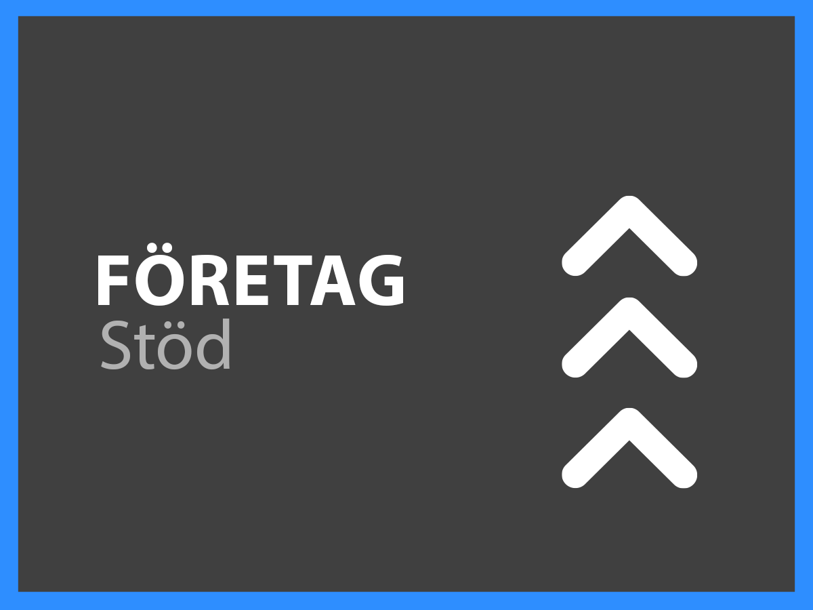

# Supporttjänster - översikt

Adobe Experience Cloud kundsupportorganisation vill att du ska lyckas. Alla prenumerationer har en nivå av support som ger enkel tillgång till våra kvalificerade tekniska resurser för teknisk hjälp.

För mer omfattande behov erbjuder vi Adobe Support-tjänster som ger tillgång till namngivna supporttekniker, snabbare svarstider på servicenivå samt sessioner för proaktiv mentorskap och servicegenomgångar. Oavsett hur komplex din support kan vara erbjuder Adobe teknisk och operativ expertis som behövs för att du ska få bästa möjliga prestanda och optimalt värde från din Adobe-lösning.

<table style="table-layout:fixed">
<tr>
  <td>
    
    

    <a href="online.md"><strong>Onlinesupport</strong></a> (vy <a href="assets/OnlineSupportDatasheet.pdf" target="_blank">PDF</a>)
    

    
Begränsad åtkomst till telefonsupport

     
  </td>
  <td>
    
    

    <a href="business.md"><strong>Företagssupport</strong></a> (vy <a href="assets/BusinessSupportDatasheet.pdf" target="_blank">PDF</a>)
    

    
Fullständig tillgång till Adobe tekniska supportteam och en kontosupportlead för kontohantering

     
  </td>
</tr>
<tr>
  <td>
    
    

    <a href="enterprise.md"><strong>Enterprise Support</strong></a> (vy <a href="assets/EnterpriseSupportDatasheet.pdf" target="_blank">PDF</a>)
    

    
Förbättrat stöd för servicenivåmål, teknisk expertis och en supporttekniker i form av en namngiven supporttekniker

     
  </td>
  <td>
    
    

    <a href="elite.md"><strong>Elitstöd</strong></a> (vy <a href="assets/EliteSupportDatasheet.pdf" target="_blank">PDF</a>)
    

    
De bästa servicenivåmålen, proaktiv support och samarbete med en teknisk kontohanterare och en supporttekniker

     
  </td>
</tr>
</table>

